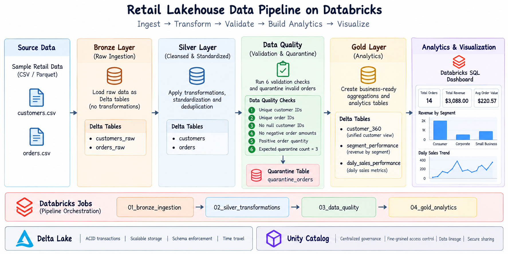
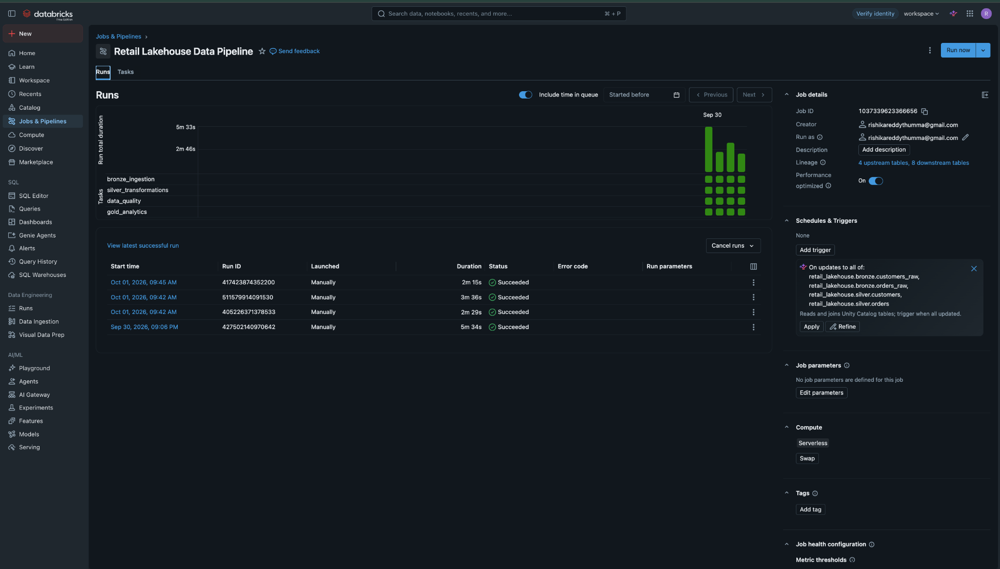
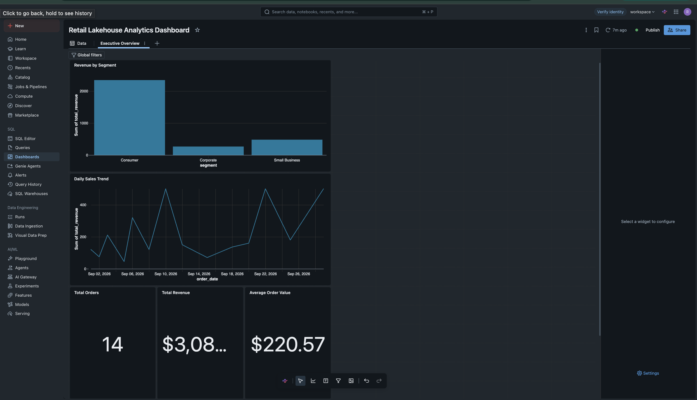

# Databricks Retail Lakehouse

An end-to-end retail analytics lakehouse built with Databricks, PySpark, Delta Lake, Unity Catalog, Databricks Jobs, and Databricks SQL.

The project implements a Medallion Architecture pipeline that ingests raw retail data, applies transformation and validation rules, quarantines invalid records, creates analytics-ready Gold models, and exposes business metrics through a Databricks SQL dashboard.

---

## Architecture



The platform follows a Bronze → Silver → Gold design, with automated data-quality checks between transformation and analytics layers.

---

## Medallion Architecture

### Bronze Layer

The Bronze layer stores raw customer and order data with ingestion metadata.

Tables:

```text
customers_raw
orders_raw
```

The customer ingestion flow also demonstrates incremental processing using Delta `MERGE` to update existing customers and insert new records.

---

### Silver Layer

The Silver layer cleans, standardizes, deduplicates, and validates Bronze data.

Tables:

```text
customers
orders
```

Invalid orders are separated into a quarantine table instead of being allowed into downstream analytics.

---

### Gold Layer

The Gold layer contains analytics-ready business models.

#### `customer_360`

Provides a consolidated customer-level view including:

- Total orders
- Total units purchased
- Total revenue
- Average order value
- Most recent order timestamp
- Customer attributes

#### `segment_performance`

Aggregates performance by customer segment, including:

- Unique customers
- Total orders
- Units sold
- Total revenue
- Average order value
- Average lifetime value

#### `daily_sales_performance`

Provides daily sales metrics including:

- Total orders
- Unique customers
- Units sold
- Total revenue
- Average order value

---

## Data Quality

The pipeline runs six validation checks before Gold models are created:

1. Customer IDs are unique
2. Order IDs are unique
3. Customer IDs contain no null values
4. Order amounts are non-negative
5. Order quantities are positive
6. Expected quarantine count is validated

All six checks must pass before the Gold analytics task runs.

The source orders dataset contains:

```text
Raw Orders           17
Valid Silver Orders  14
Quarantined Orders    3
```

Invalid records include examples such as:

- Missing customer IDs
- Negative quantities
- Negative order amounts

This creates an explicit data-quality gate between transformation and analytics.

---

## Pipeline Orchestration

The Databricks Job executes four dependent tasks:

```text
01_bronze_ingestion
        |
        v
02_silver_transformations
        |
        v
03_data_quality
        |
        v
04_gold_analytics
```

The tasks execute sequentially so downstream analytics tables are only created after ingestion, transformation, and validation complete successfully.



---

## Analytics Dashboard

A Databricks SQL dashboard provides a business-facing view of the Gold layer.

Current dashboard metrics include:

| Metric | Value |
|---|---:|
| Total Orders | 14 |
| Total Revenue | $3,088.00 |
| Average Order Value | $220.57 |

The dashboard also includes:

- Revenue by segment
- Daily sales trend



---

## Delta Lake Features

The project uses Delta Lake for:

- ACID-compatible tables
- Incremental `MERGE` upserts
- Schema enforcement
- Table history
- Versioning
- Time travel

For example, the Bronze customer table grows from 10 initial records to 12 after an incremental customer batch is processed.

---

## Incremental Processing

Delta `MERGE` is used to handle new and updated customer records.

This allows the pipeline to process incremental changes instead of rebuilding the complete dataset.

A simplified flow:

```text
Incoming Customer Batch
        |
        v
Existing Delta Table
        |
        v
Delta MERGE
   /          \
  v            v
UPDATE        INSERT
existing      new
records       records
```

---

## Unity Catalog

Unity Catalog is used to organize and manage lakehouse data objects.

The project demonstrates structured organization of:

- Bronze tables
- Silver tables
- Gold analytics models

This keeps data layers clearly separated and easier to manage.

---

## Tech Stack

| Area | Technology |
|---|---|
| Data Platform | Databricks |
| Processing | Apache Spark, PySpark |
| SQL Processing | Spark SQL |
| Storage | Delta Lake |
| Governance | Unity Catalog |
| Orchestration | Databricks Jobs |
| Analytics | Databricks SQL |
| Languages | Python, SQL |

---

## Repository Structure

```text
databricks-retail-lakehouse/
├── notebooks/
│   ├── 01_bronze_ingestion.py
│   ├── 02_silver_transformations.py
│   ├── 03_data_quality.py
│   └── 04_gold_analytics.py
├── sql/
│   ├── 01_segment_performance.sql
│   ├── 02_daily_sales_trend.sql
│   └── 03_kpi_summary.sql
├── docs/
│   ├── architecture.png
│   ├── dashboard.png
│   └── workflow_run.png
└── README.md
```

---

## Running the Project

Run the notebooks in this order:

```text
01_bronze_ingestion
02_silver_transformations
03_data_quality
04_gold_analytics
```

Alternatively, run the `Retail Lakehouse Data Pipeline` Databricks Job to execute the complete workflow.

The project uses a small embedded sample dataset so the pipeline can be reproduced without external data dependencies.

---

## Engineering Highlights

This project demonstrates:

- Medallion Architecture
- Bronze, Silver, and Gold modeling
- Incremental Delta processing
- Delta `MERGE` upserts
- Automated data-quality gates
- Quarantine handling
- Customer 360 modeling
- Business-ready analytical marts
- Databricks Jobs orchestration
- Databricks SQL analytics
- Delta Lake time travel
- Unity Catalog organization

---

## Future Improvements

- Auto Loader for incremental file ingestion
- Delta Live Tables
- Additional data-quality checks
- Streaming ingestion
- More advanced customer segmentation
- Revenue forecasting
- Customer lifetime value modeling
- Pipeline monitoring and alerting
- Cost and cluster optimization
